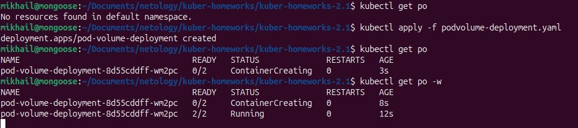
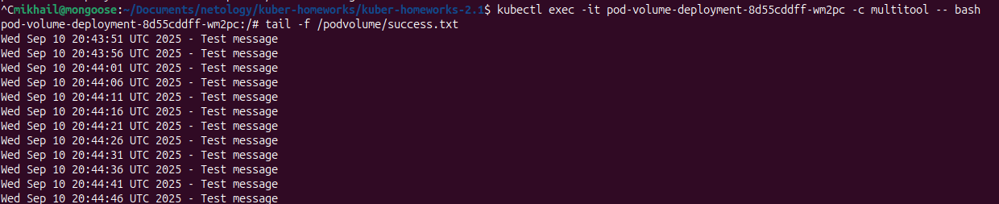
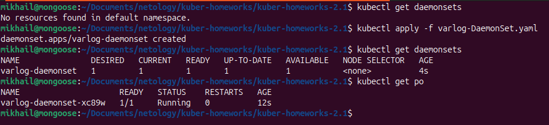
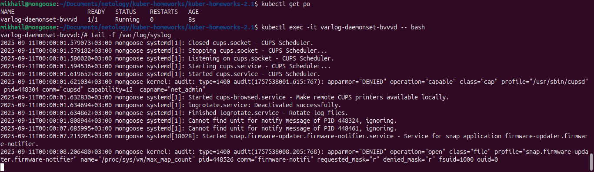

# Домашнее задание к занятию «Хранение в K8s. Часть 1» -- Байков Михаил

### Задание 1 

**Что нужно сделать**

Создать Deployment приложения, состоящего из двух контейнеров и обменивающихся данными.

1. Создать Deployment приложения, состоящего из контейнеров busybox и multitool.
2. Сделать так, чтобы busybox писал каждые пять секунд в некий файл в общей директории.
3. Обеспечить возможность чтения файла контейнером multitool.
4. Продемонстрировать, что multitool может читать файл, который периодоически обновляется.
5. Предоставить манифесты Deployment в решении, а также скриншоты или вывод команды из п. 4.

#### Решение 1
1. Создаем `Deployment` манифест `podvolume-deployment.yaml` для пода с двумя контейнерами на основе `busybox` и `multitool` с общим томом `podvolume` для обоих контейнеров. Применяем манифест. Проверяем результат.

2. Проверяем возможность чтения из контейнера `multitool` файла созданного и наполняемого в контейнере `busybox`.

------

### Задание 2

**Что нужно сделать**

Создать DaemonSet приложения, которое может прочитать логи ноды.

1. Создать DaemonSet приложения, состоящего из multitool.
2. Обеспечить возможность чтения файла `/var/log/syslog` кластера MicroK8S.
3. Продемонстрировать возможность чтения файла изнутри пода.
4. Предоставить манифесты Deployment, а также скриншоты или вывод команды из п. 2.

#### Решение 2
1. Создаем манифест `DsemonSet` `varlog-DaemonSet.yaml` на основе образа `multitool` и монтируем в под директорию хостовую директорию /var/log. Применяем манифест и проверяем результат.

2. Проверяем возможность чтения логфайла `syslog` из примонтированной хостовой директории `/var/log`.

------